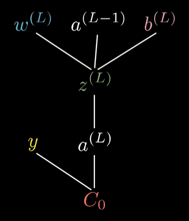

# ml-cc
Keep exercises and studies during [Google Machine Learning Crash Course](https://developers.google.com/machine-learning/crash-course?hl=pt-br).

## ML Terminology
- Label (`y`): variable to predict;
- Features (`X`): input variables;
- Example: particular instance of data. Can be labeled (X, y) or unlabeled (X, ?). Labeled examples are used to train the model;
- Model: maps examples to predicted labels y'. A regression model predicts continuous values and a classification model predicts discrete values.

## Linear Regression
Determine a equation for a line that shows the relationship between N features and labels using the labeled examples.

$ y' = b + w_1 \cdot x_1 + ... + w_N \cdot x_N  $

where:
- `b` (or $ w_0 $): bias (y-intercept)
- `w`: weight related to each feature

## Training and Loss
Training a model means learning(determining) good values for weights and the bias from labeled examples. In supervised learning, a ml algorithm builds a model by examining many examples and attempting to find a model that minimize loss (penalty for a bad prediction). This process is called empirical risk minimization.

### Squared Loss ($ L_2 $ loss)
Common used in linear regression models.

The $ L_2 $ loss for a single example is: $ (y - prediction(x))^2 = (y - y')^2 $

### Mean square error (MSE)
Is the average squared loss per example over all N dataset examples.

$ MSE = 1/N \cdot \sum_{i=0}^{N} (y_i - y'_i)^2 $

## Reducing Loss

### Gradient Descent
The gradient of a function is a vector that points in the direction of the greatest rate of increase of the function, and whose magnitude is that rate of increase. So if we want to minimize the loss function, we have to go in the opposite direction of the gradient.

To calculate the gradient, we have to calculate the derivative of the loss function with respect to the weights and biases.

So we reapeatedly take small steps in the direction that minimizes the loss.

But compute the gradient over the entire dataset on each step is unnecessary and will spend a lot of computation.So we have techniques to make this more efficiently:

#### Stochastic Gradient Descent (SGD)
Look at only one example for step.

#### Mini-Batch Stochastic Gradient Descent
Look at random batches (groups of 10-1000 examples) for step, then average the Loss & Gradients over the batch.

### Weights Initialization
Usually the loss function isn't convex, i.e, has more than one minimun. This means that the training performance has strong dependency on initial values.

### Hyperparameters
Hyperparameters are the configuration settings used to tune how the model is trained.

Examples are the BATCH_SIZE, LEARNING_RATE, ...

### Learning rate
Gradient descent algorithm multiply the gradient by a scalar known as learning rate (also sometimes called step size) to determine the next point.

To perform a good training we have to used the right learning rate. If the LR is too small, learning will take too long. Conversely, if the LR is too large, the next point will perpetually bounce across the bottom of the loss function.

## Generalization
Generalization refers to your model's ability to adapt properly to new, previously unseen data, drawn from the same distribution as the one used to create the model.

### Overfitting
When the model learns details and noise from training data so well that it loses the ability to generalize to new data. This means that the model may perform excellently on training data, but perform poorly on previously unseen data.

| Overfitted model after training | Overfitted model during test |
|----------|----------|
|  | ) |

A good way to stop overfitting is reducing the models complexity and removing noise and outliers from the training dataset.

### Diving the dataset
A nice way to see if the model is good for generalization is getting a sample of the data and using it only for testing. Good performance on the test set is a useful indicator of good performance on the new data in general, assuming that:
- the test-set is large enough
- you don´t cheat by using the same test set over and over

This separation must be random, stationary (i.e, it doesn´t change over time) and always from the same data distribution.

## Data partitioning scheme
To avoid overfitting in test data, comes a new partitioning called validation-set.

- TRAINING-SET: Used to train the model.

- VALIDATION-SET: Used to evaluate model during training and adjust hyperparameters.

- TEST-SET: Ignored during training, it is only used to evaluate the model generalization performance (i.e, check if the model is overfitting to the validation-set)

OBS: Before splitting the data, is good to suffle the dataset to prevent the dataset from being ordered by some feature that influences the label.

## Feature engineering
Mapping Raw Data to Features.

### Mapping numeric values
Trivial because the feature will have the same value of the raw data

Example:

(raw data) num_rooms: 6 => (feature) num_rooms_feature  = 6.0

### Mapping categorical string values
Since models cannot multiply strings by the learned weights, we use feature engineering to convert strings to numeric values.

Example:

(raw data) street_name: ['Charleston Road', 'Shorebird Way', 'Rengstorff Avenue', others...]

- 'Charleston Road' => 0
- 'Shorebird Way' => 1
- 'Rengstorff Avenue' => 2
- others (Out-Of-Vocabulary bucket) => 3

(feature) street_name_feature: [0, 1, 2, 3...]

However, if we incorporate these index numbers directly into our model, it will impose some constraints that might be problematic.

- If the model learn one weight to street_name_feature, it will be multiplied for different values. Our model needs the flexibility of learning different weights for each street.

- If the house is in a corner, we can´t represent this in the structure above.

Solution:

#### one-hot encoding

- For values that apply to the example, set correspong vector element to `1`
- Set all other elements to `0`

The lenght of this vector is equal to the number of elements in the vocabulary.

This approach effectively creates a Boolean variable for every feature possible value (e.g., street name)

So if the value is 0, it will turn the value * weight product to 0. And if the example has two values, then both will be `1` and the rest will be zero (e.g., if the house is in the corner, the two binary values related to the streets are set to 1, and the model will uses both their respective weights).

(raw data) street_name: 'Shorebird Way' => (feature) street_name_feature = [0, 1, 0, 0...]

##### Sparse representation
Suppose that you had 1,000,000 different street names in your data set that you wanted to include as values for street_name. Explicitly creating a binary vector of 1,000,000 elements where only 1 or 2 elements are true is a very inefficient representation in terms of both storage and computation time when processing these vectors. In this situation, a common approach is to use a sparse representation in which only nonzero values are stored. In sparse representations, an independent model weight is still learned for each feature value, as described above.

## Qualities of Good Features

### Avoid rarely used discrete feature values

Example: "house_type" is a good feature because it´s possible values (['victorian', 'modern', 'kitnet']) will reapeat over the examples and the model will be abble to recognize it´s patterns. But a feature like "unique_house_id" is a bad feature because each value would be used only once, so the model couldn't learn anything from it.

### Prefer clear and obvious meanings

Example: "house_age_years: 27" (years) is better for debbug than "house_age: 851472000" (time since unix)

### Don´t mix "magic" values with actual data

Example: imagine that we have a 0 to 1 float feature like "quality_rating". It´s NOT a good ideia to represent with -1 when the user didn´t entered the quality rating. Instead, it´s a better way creating a feature named "is_quality_rating_defined" and set it to 0.

In the original feature, replace the magic value as follows:
- For variables that take a finite set of values (discrete variables), add a new value to the set and use it to signify that the feature value is missing.
- For continuous variables, ensure missing values do not affect the model by using the mean value of the feature's data.

### Don´t choose values that can possibly change in the future to represent a feature

## Cleaning data
Good ML relies on good data.

### Scalling feature values
Scaling means converting floating-point feature values from their natural range (for example, 100 to 900) into a standard range (for example, 0 to 1 or -1 to +1). Feature scalling provides the following benefits:

- Helps gradient descent converge more quickly
- Helps avoid the "NaN trap" (values exceeds the floating-point precision limit during training)
- Helps the model learn appropriate weights for each feature. Without feature scaling, the model will pay too much attention to the features having a wider range.

#### Linerly map [min value, max value] to a small scale, such as [-1, 1]

#### Z score
Transforms the data to have the mean equal to 0 and the standard deviation equal to 1.

$ scaledvalue = (value - mean) / stddev $

Note that it scalles ~98% of the values to the range [-3, +3]. (only huge outliers stay out of this range)

### Handling extreme outliers
First of all we need to find the outliers, for that, is useful to plot the Probability Density Function of the feature and see if it has a "tail". A long "tail" means that are some huge outliers. 

To minimize the effect of this outliers, we can apply the $ log $ on the feature or set the feature to $ feature = min(feature, L) $ where $ L $ is the value that we will clip the outliers.

### Binning
If we´re working with latitude, for example, is useful to separate latitude in bins,

example: LatitudeBin1 = 32 < latitude <= 33; (...); LatitudeBin6 = 37 < latitude <= 38;

Doing that, instead of having a floatting-point feature, we now have 11 distinc boolean features, that we can unite to a single 11-element-vector. Doing that we can avoid rarely used discrete feature values and our model can learn weights for each region.

### Scrubbing
Clean data that are not trustworthy, for example,
- ommited values
- duplicate examples
- wrong labels
- wrong feature values (sensor readding errors, ...)

## Feature Crosses
A feature cross is a synthetic feature formed by multiplying (crossing) two or more features. With feature crosses we can input non-linearity to linear models.

## Regularization
Regularization means penalizing the complexity of a model to reduce overfitting.

Before the goal of the training optimization algorithm was only reducing loss:

$ minimize(Loss(Data, Model)) $

Now, we want to continue minimizing the loss, but minimize also the complexity of the model:

$ minimize(Loss(Data, Model) + complexity(Model)) $

We can quantify `complexity` using the **$ L_2 $ regularization**, which defines the regularization term as the sum of the squares of all the feature weights:

$ L_2 $ $ regularization = w_1^{2} + w_2^{2} + ... + w_n^{2} $

In this formula, weights close to zero have little effect on model complexity, while outlier weights can have a huge impact.

This approach follows the Bayesian prior:
- weights should be centered around zero
- weights shoud be normally distributed

### Lambda (Regularization rate)

$ minimize = (Loss(Data, Model) + λ * complexity(Model)) $

$ = (Loss(Data, Model) + λ * (w_1^{2} + ... + w_n^{2})) $

Note that the second term doesn´t depend on the data and the two terms are balanced with the `λ` coefficient, which says how much we care about learning w/ the training data Versus making a simple model.

## Logistic Regression
Instead of predicting exactly 0 or 1, logistic regression generates a probability—a value between 0 and 1, exclusive.

This approach is useful for calculating the probability and to map into a binary classification problem.

### Sigmoid function
Restrict(squeezes) the output to always falls between 0 and 1.

$ \large σ(z) = \frac{1}{1 + e^{-z}} $, where `z` is the output of a the linear layer ($ z = b + W * X $)

This function basically turns every negative number into a value near to zero, every positive number into a value near to one and increases 'constantly' around the input zero.

Note that `z` is also referred to as the log-odds because the inverse of the sigmoid states that `z` can be defined as the log of the probability of the `1` label divided by the probability of the `0` label.

$ z = log(\frac{σ}{1 - σ}) $

### Log Loss: Loss function for Logistic Regression
the loss function for linear regression is squared loss. The loss function for logistic regression is the **Log Loss**, which is defined as follows:

$ \large Log Loss = \sum_{(x,y) ∈ D} -y * log(y') - (1 - y) * log(1 - y') $

where:

-  `(x,y) ∈ D`: data set containing many labeled examples ($ (x,y) $ pairs).
- `y`: label in the labeled example (`0` or `1`).
- `y'`: predicted value (between `0` and `1`)

### Regularization in Logistic Regression
Regularization is extremely important in logistic regression modeling. Without regularization, the asymptotic nature of logistic regression would keep driving loss towards 0 in high dimensions.

## Classification
We can classificate examples applying a **classification threshold** to the output of a logistic regressor. The choice of the threshold is very important and can be tuned.

Ex.: We can mark a email as span if the logistic regressor output says that the probability of being spam is bigger than 0.8. In this case, the threshold is 0.8.

### Evaluating classification models

#### Accuracy
Calculate the fraction of the predictions we got right, i.e., correct predictions divided by the number of predictions.

#### True positives (TP's) and False Positives (FP's)

| True Positives | False Positives |
|----------------|-----------------|
| We correctly called wolf! We saved the town. | Error: we called wolf falsely. Everyone is mad at us. |

| False Negatives | True Negatives |
|-----------------|----------------|
| There was a wolf, but we didn't spot it. It ate all our chickens | No wolf, no alarm. Everyone is fine |

#### Precision
$ precision = (True Positives) / (All Positive Predictions) $

Intuition: "Did the model cry "wolf" too often?"

#### Recall
$ recall = (True Positives) / (All Actual Positives) $

Intuition: "Did it miss any wolves?"

Note that if model precision is low, an intuitive way to correct it is by raising the classification threshold. However, this can cause the model to miss some True Positives, thereby lowering its Recall.

Conversely, if the model recall is low, an intuitive way to correct it is by lowering the classification threshold. However, this can cause the model to guess some False Positives, thereby lowering its Precision.

It means that you cannot look at precision or recall individually, you need to analyse both togheter.

#### A ROC Curve
Looks at the performance of the model over all possibles classification thresholds.

It is obtained by calculating the TP Rate and the FP Rate for all posible classification thresholds and then plotting a graph with the FP Rate in the horizontal and the TP Rate in the vertical.

where $ TPR = \frac{TP}{TP + FN} $ and $ FPR = \frac{FP}{FP + TN} $

##### AUC
The Area Under the ROC Curve (i.e., the integral of the ROC Curve).

The closer the AUC value is to 1, the better the model's ability to correctly classify instances between positive and negative classes.

## Regularization for Sparsity
Many dimensional feature crosses may significantly increase feature space. This can cause the following possible issues:

- Model size (RAM) become huge
- "Noise" coefficients (causes overfitting)

The solution is turn some weights to zero, being carefully to not lose important coefficients.

### $ L_0 Regularization $
Penalizes weights that are not zero, it´s the ideal, but envolve Non-convex optimization (NP-hard).

### $ L_1 Regularization $
- Penalize sum of $ abs(weights) $
- Convex problem
- Encourage sparsity unlike $ L_2 $

For example, take a look at the values of the weights after the training loop, using different regularizations:

$ L_1 $ on top and $ L_2 $ on bottom:

Note that $ L_1 $ encourage weights to turn 0, while $ L_2 $ encourage weights to became nearly 0 (i.e., don't provide sparsity).

## Neural Networks
Neural networks are a more sophisticated version of feature crosses. In essence, neural networks learn the appropriate feature crosses for us, giving us a way to learn nonlinear models without the use of explicit feature crosses

### Neuron

Fundamental unit of a neural network. It takes in some inputs, makes some ponderations and outputs a value. Each input has a weight associated with it. The neuron sums all the inputs multiplied by their weights, subtract for your bias and then applies an activation function to the result. The weights and biases are adjusted during the training process.

$\Large y = f(\sum_{i=1}^{n} w_i \cdot x_i - b)$

- `y`: neuron output (**neuron activation**)
- `f`: activation function
- `w`: weight associated with each input $x_i$
- `x`: input
- `b`: bias
- `n`: number of inputs (= number of neurons in the previous layer)
- `i`: index of the input

### Layer

A layer is a collection of neurons. Each neuron in a layer takes the same inputs (from the previous layer, or, if it is the input layer, from the input), multiply by the weights and applies the same activation function. The output of a layer is the output of each neuron in the layer.

The network is composed of an input layer, an output layer and one or more "hidden" layers.
Note that the input layer does not perform any computation, it just passes the input to the first hidden layer.

### Activation Function

Restricts (Squeezes) the output of a neuron to a certain range. A common activation function is the **sigmoid function**:

$\Large \sigma(x) = \frac{1}{1 + e^{-x}}$

This function basically turns every negative number into a value near to zero, every positive number into a value near to one and increases 'constantly' around the input zero.

Another common activation function is the **ReLU function** (Rectified Linear Unit)):

$\Large ReLU(x) = max(0, x)$

This function turns every negative number into zero and every positive number into itself.

### Bias

Measure of how high the weighted sum of the inputs must be before the neuron is activated with the activation function. It is a constant value that is added to the weighted sum of the inputs. It is a way to adjust the output of the neuron.

## Algebric Representation

Here are some important algebric representations of the neural network:

- $W^{(L)}$: Weights matrix of layer $L$
- $b^{(L)}$: Bias vector of layer $L$
- $z^{(L)}$: Output of layer $L$ before activation
- $a^{(L)}$: Output of layer $L$ after activation
- $X$: Input of the network
- $Y$: Output of the network
- $a^{(L)}=f(z^{(L)})$: Activation function of layer $L$
- $z^{(L)}=W^{(L)} \cdot a^{(L-1)} + b^{(L)}$: Feedforward

## Learning

Find the best weights and biases for a neural network to solve a problem. For this, the Neural Network must be trained with a lot of examples of the problem. Training a NN happens in two steps:

1. **Feedforward**: In forward prop, the NN makes its best guess about the correct output. It runs the input data through each of its functions to make this guess.
2. **Backward Propagation**: In backprop, the NN adjusts its parameters proportionate to the error in its guess. It does this by traversing backwards from the output, collecting the derivatives of the error with respect to the parameters of the functions (gradients), and optimizing the parameters using gradient descent.

The weights and biases are randomly initialized or is used some kind of Transfer Learning.

### Cost Function

Takes all the weights and biases of the network as inputs, all training data as the parameters and outputs the cost, a single number that represents how well the network performs.

#### Mean Squared Error

Sum of the squared differences between the network output and the expected output.

#### Gradient of the Cost Function

Tell us wich direction to change the weights and biases to make the network perform better, i.e. wich direction to go to minimize the cost function.

The gradient of a function is a vector that points in the direction of the greatest rate of increase of the function, and whose magnitude is that rate of increase. So if we want **to minimize the cost function, we have to go in the opposite direction of the gradient**:

$-\nabla(C)$, where $C$ is the cost function.

Note that is important to the cost function to have an nice smooth output, so we can find the local minimum easily. This is why artificial neurons have continuosly ranged activations, instead of being binary.

The process of finding the minimum of a function is called **gradient descent**.

### Backpropagation

It's a algorithm that calculates how a single training example would change the weights and biases of the network.

The ideal would be calculating the gradient of the cost function for all the training examples and then average them. But this is computationally expensive, so we use a technique called **stochastic gradient descent**. It calculates the gradient of the cost function for random subsets of the training examples (called **mini-batches**).

### Backpropagation Calculus

#### Chain Rule

Imagine a network with one neuron per layer.

The last layer ($L$) can be drawn like this:

The activation of the last layer ($a^{(L)}$) is calculated using the activation of the previous layer ($a^{(L-1)}$), the weight ($w^{(L)}$) and it's bias ($b^{(L)}$), then applying the activation function ($f$):

$\Large a^{(L)} = f(z^{(L)}) = f(w^{(L)} \cdot a^{(L-1)} + b^{(L)})$

Then, the cost of the example 0 ($C_0$) can be calculated using the activation of the last layer ($a^{(L)}$) and the expected output ($y_0$):

$\Large C_0=(a^{(L)}-y)^{2}$

So, we can use the chain rule to calculate the sensitivity of the cost function ($C_0$) relative to small changes in the weight ($w^{(L)}$):

$\Large \frac{\partial C_0}{\partial w^{(L)}} = \frac{\partial z^{(L)}}{\partial w^{(L)}} \cdot \frac{\partial a^{(L)}}{\partial z^{(L)}} \cdot \frac{\partial C_0}{\partial a^{(L)}}$

But $\frac{\partial z^{(L)}}{\partial w^{(L)}} = a^{(L-1)}$ , $\frac{\partial a^{(L)}}{\partial z^{(L)}} = f'(z^{(L)})$ and $\frac{\partial C_0}{\partial a^{(L)}} = 2(a^{(L)} - y)$;

Then, we have:

$\Large \frac{\partial C_0}{\partial w^{(L)}} = a^{(L-1)} \cdot f'(z^{(L)}) \cdot 2(a^{(L)} - y)$

Note that is the derivative considering one example on the training data, the derivative of the full cost function will be the average of all training examples:

$\Large \frac{\partial C}{\partial w^{(L)}} = \frac{1}{n} \cdot \sum_{k=0}^{n-1} \frac{\partial C_k}{\partial w^{(L)}}$

The same reasoning can be used to calculate the sensitivity for the bias:

$\Large \frac{\partial C_0}{\partial b^{(L)}} = \frac{\partial z^{(L)}}{\partial b^{(L)}} \cdot \frac{\partial a^{(L)}}{\partial z^{(L)}} \cdot \frac{\partial C_0}{\partial a^{(L)}}$

$\Large \frac{\partial C_0}{\partial w^{(L)}} = 1 \cdot f'(z^{(L)}) \cdot 2(a^{(L)} - y)$

Another important derivative is the sensitivity of the cost function for the activation of the previous layer:

$\Large \frac{\partial C_0}{\partial a^{(L-1)}} = \frac{\partial z^{(L)}}{\partial a^{(L-1)}} \cdot \frac{\partial a^{(L)}}{\partial z^{(L)}} \cdot \frac{\partial C_0}{\partial a^{(L)}}$

$\Large \frac{\partial C_0}{\partial a^{(L-1)}} = w^{(L)} \cdot f'(z^{(L)}) \cdot 2(a^{(L)} - y)$

Now, we can keep iterating the same chain rule idea backwards to see how the cost function is sensitve to previous weights and previous bias.

This same idea can be applied in networks with more then one neuron per layer.

##### Recap

This chain rule expressions give you the derivatives that determine each component in the gradient $\nabla(C)$ of the cost function, that helps minimize the cost of the network by repeatedly stepping downhill.